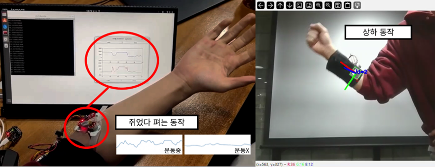
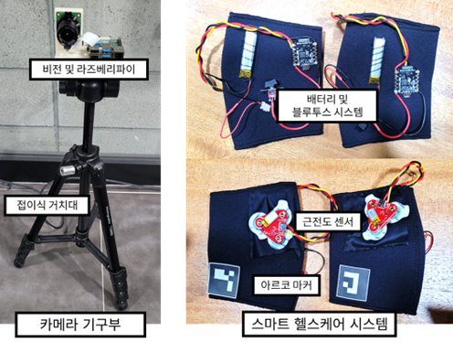

## 퍼스널 트레이닝 기능을 겸비한 스마트 헬스케어 시스템
### 개요
- 스마트 헬스 케어 시스템 구성 시연 영상 촬영을 위한 레포지토리입니다.

### 개발기간
- 2023/12/06 ~ 2023/12/23

### 개발 환경
#### 소프트웨어
##### 컴파일러
- `g++ 13.2 or newer`
- `Arduino Compiler`
##### 라이브러리
- CMake 3.27.9 or newer
  - Homepage: https://cmake.org/
- QT 6.6.1 or newer
  - Homepage: https://www.qt.io/
- OpenCV 4.8.1 or newer
  - Homepage: https://opencv.org/
- WiringPi 2.50 or newer
  - Homepage: http://wiringpi.com/
- Numpy 1.26.2 or newer
  - Homepage: https://numpy.org/
- Matplotlib 3.8.2 or newer
  - Homepage: https://matplotlib.org/
- GStreamer 1.22.8 or newer
  - Homepage: https://gstreamer.freedesktop.org/
#### 하드웨어
- 센서
  - MyoWare 2.0 Muscle Sensor
  - Raspberry Pi Global Shutter Cammera
- 통신 모듈
  - Bluno Beetle
- 마이크로 컨트롤러
  - Raspberry PI 4
  - Arduino mega
  - Atmega328 (Built in Blueno Beetle)
